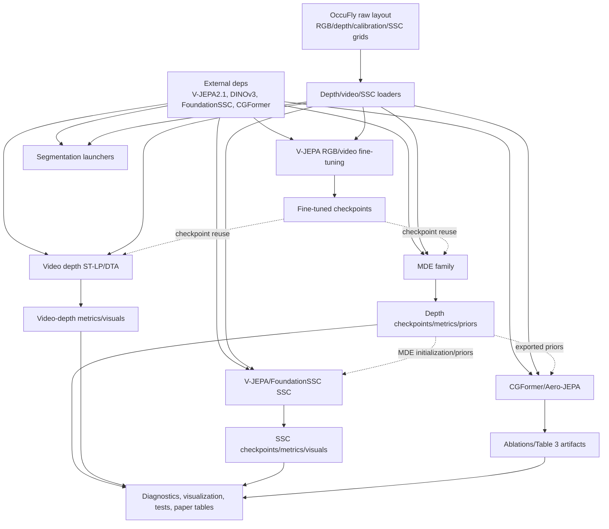

# Reconstructed implementation graph: evidence notes

This graph was reconstructed from the uploaded implementation-only archive rooted at `experiments_related`. It maps implementation families and staged artifacts; it does not claim that any training run completed or that any metric value was achieved.

## Edge semantics

- Solid edges in the DOT/SVG/PDF graph indicate direct script/module wiring, explicit imports, launch calls, or direct data loading conventions visible in the files.
- Dashed edges indicate staged filesystem dependencies inferred from output/checkpoint paths, CLI arguments, or wrapper scripts. These are marked as inferred because the archive does not include the produced artifacts.

## Source evidence by graph node

| Graph node | Evidence paths |
|---|---|
| OccuFly raw data conventions | `scripts/03_train_vjepa_linear_depth.py` documents `scene_XX/{30,40,50}/images/visual` and `depth_maps`; `scripts/06_vjepa21_dinov3_linearprobe_occufly.py` uses the same scene split/layout; `scripts/dpt_decoder/train_vjepa21_vitG_dpt_film_occufly.py` reads `calibration.txt`; SSC loaders are in `scripts_ssc/*/vjepafoundationssc/occufly_ssc_data.py` and label/grid config files. |
| Shared loaders / metadata | Depth loaders: `scripts/03_train_vjepa_linear_depth.py`, `scripts/06_vjepa21_dinov3_linearprobe_occufly.py`, `scripts/07_vjepa21_dinov3_DPT_multilayer_decoder_occufly.py`, `scripts/dpt_decoder/*.py`. Video/clip handling: `scripts/11_vjepa21_finetune_occufly_video.py`, `vjepa21video_scripts/src/vjepa21video_depth/*`. SSC loaders: `scripts_ssc/*/vjepafoundationssc/occufly_ssc_data.py`, `occufly_labels.py`, `occufly_grid_config.json`. |
| External dependencies | V-JEPA/V-JEPA2.1 usage appears in `scripts/03_train_vjepa_linear_depth.py`, `scripts/08_vjepa21_finetune_occufly.py`, `scripts/11_vjepa21_finetune_occufly_video.py`, `scripts_ssc/*/backbone_factory.py`, and `video_backbone_factory.py`. DINOv3 depth imports appear in `scripts/06_vjepa21_dinov3_linearprobe_occufly.py`, `scripts/07_vjepa21_dinov3_DPT_multilayer_decoder_occufly.py`, and SSC DPT-FiLM heads. FoundationSSC is bootstrapped in `scripts_ssc/*/vjepafoundationssc/repo_paths.py` and wrapped in `foundation_ssc/real_adapters.py`. CGFormer dependencies appear under `scripts_ssc/cgformer/common/*` and the Aero-JEPA project. |
| Monocular depth estimation | Linear probe: `scripts/03_train_vjepa_linear_depth.py`. DINO-style probe: `scripts/06_vjepa21_dinov3_linearprobe_occufly.py` and `scripts/vjepa21_dinov3_depth_adapter.py`. DPT multilayer: `scripts/07_vjepa21_dinov3_DPT_multilayer_decoder_occufly.py`. DPT-FiLM/altitude/SFP variants: `scripts/dpt_decoder/train_vjepa21_vitG_dpt_film_occufly.py`, `train_vjepa21_vitG_dpt_altitude_feature_occufly.py`, and `train_vjepa21_vitG_final_sfp_dpt_film_occufly.py`. |
| V-JEPA OccuFly adaptation wrappers | RGB wrapper: `scripts/08_vjepa21_finetune_occufly.py`; video wrapper: `scripts/11_vjepa21_finetune_occufly_video.py`; fine-tuned probe wrappers: `scripts/10_vjepa21_finetuned_linearprobe_occufly.py`, `scripts/11_vjepa21_finetuned_DPT_multilayer_decoder_occufly.py`, `scripts/run_finetuned_video_*_sweep_ddp.sh`. |
| Video depth | ST-LP launcher and training code: `vjepa21video_scripts/scripts/train_stlp_depth.py`, `vjepa21video_scripts/src/vjepa21video_depth/*`, `vjepa21video_scripts/run_all_stlp_experiments.sh`. DTA DPT-FiLM: `vjepa21video_scripts/vjepa21video_dptfilm_attention/scripts/train_video_dptfilm_attention.py`, `src/vjepa21video_dptfilm_attention/temporal_attention.py`, `train_eval.py`. |
| Semantic segmentation | `scripts_segmentation/dataset_download/download_voc12.sh`, `scripts_segmentation/linear_pipeline/run_vjepa21_voc12_linear_sweep.sh`, `scripts_segmentation/linear_pipeline/run_vjepa21_occufly_linear_sweep.sh`, and `scripts_segmentation/linear_pipeline/occufly_21class_label_map.json`. |
| V-JEPA/FoundationSSC SSC | Scaffold: `scripts_ssc/vjepafoundationssc/*`; frozen-depth variant: `scripts_ssc/vjepafoundationssc_frozendepthhead/*`; hybrid branch: `scripts_ssc/vjepa21video_posemvs_film_consistent_foundationssc_hybrid/vjepafoundationssc/train_vjepa_occufly_ssc.py` and associated modules. The hybrid trainer imports backbones, temporal attention, pose-MVS, DPT-FiLM depth probability, FoundationSSC adapters, losses, metrics, labels, and data loaders in its top-level import block. |
| SSC geometry and FoundationSSC adapter | `scripts_ssc/vjepa21video_posemvs_film_consistent_foundationssc_hybrid/vjepafoundationssc/dpt_film_depth_probability_head.py`, `pose_mvs_geometry.py`, `foundation_ssc/real_adapters.py`, `foundation_ssc/context_adapter.py`, `foundation_ssc/hybrid_view_transform.py`, `foundation_ssc/fusion.py`, `foundation_ssc/decoder.py`, `foundation_ssc/voxel_proposal.py`, and `foundation_ssc/voxel_transformer.py`. |
| MDE-to-SSC checkpoint edge | Inferred staged edge. The hybrid SSC trainer defines a default MDE checkpoint path and has a loader path for initializing the SSC depth branch from MDE weights in `scripts_ssc/vjepa21video_posemvs_film_consistent_foundationssc_hybrid/vjepafoundationssc/train_vjepa_occufly_ssc.py`. The archive excludes the checkpoint itself. |
| CGFormer / Aero-JEPA | Common CGFormer utilities: `scripts_ssc/cgformer/common/*`. Depth-prior export launcher: `scripts_ssc/cgformer/vitGFilmaltitudeconditioning/export_vjepa21vitGdptFilm_priors.py`. Aero-JEPA project: `scripts_ssc/cgformer/aero_jepa_ssc_project/configs/occufly/*.yaml`, `src/aero_jepa_ssc/config.py`, `data/*`, `geometry/*`, `models/*`, `losses/*`, `tools/*`, and `tests/*`. |
| Diagnostics, visualization, tests, paper tables | `scripts/diagnostics/*`, `scripts/visualization/*`, `scripts/visualizations_rgv_vs_video/*`, `scripts_ssc/vizualization/*`, `tests/*.py`, `scripts/paper_mde_grouped_tables.py`, `scripts/best20rmse_mde_pipeline/update_best20rmse.py`, and `forpaper_report/*`. |

## Mermaid version

